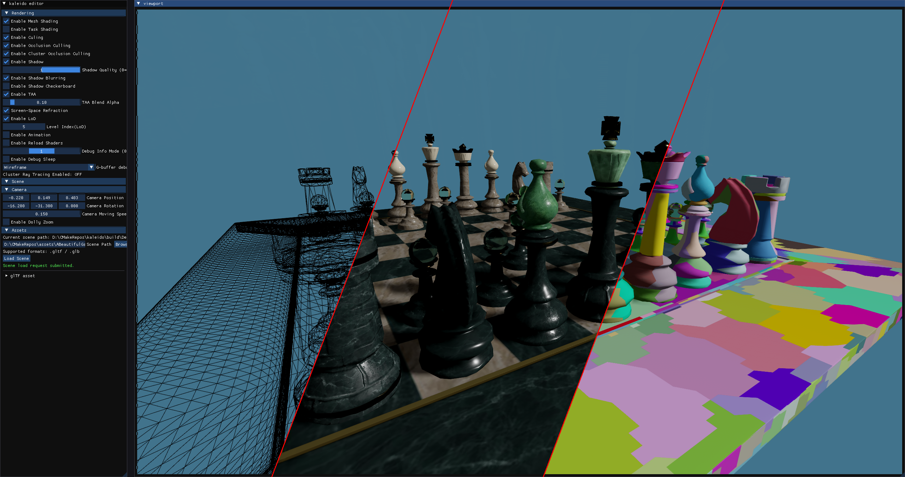
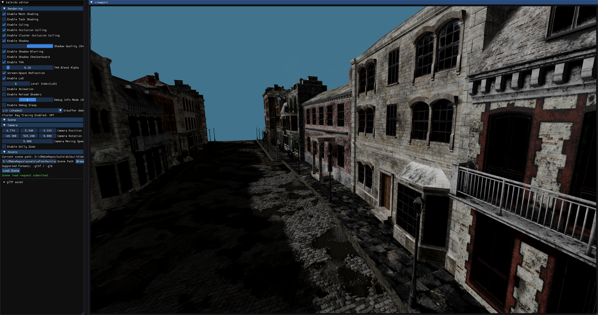
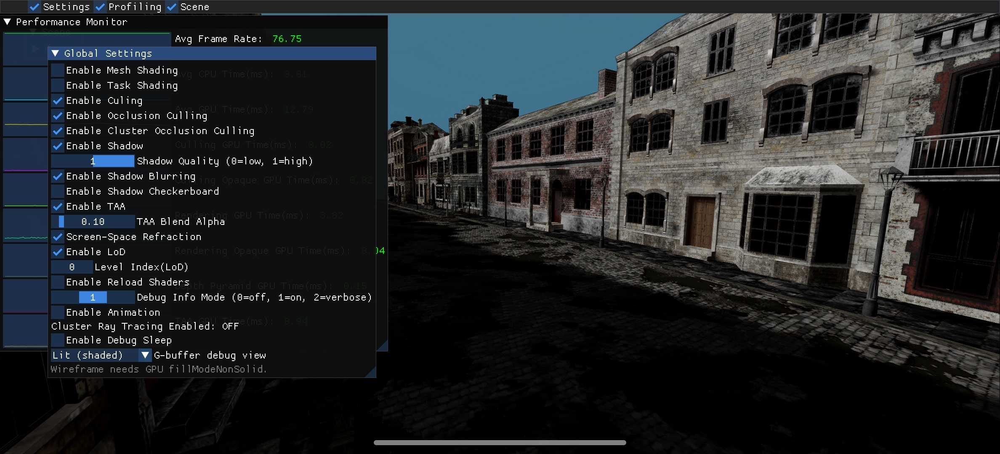

# kaleido

Personal learning project based on [Zeux’s Niagara streaming Vulkan tutorials](https://github.com/zeux/niagara). The codebase extends that material with extra experiments—Android builds, additional rendering paths, and editor-style tooling.

## Screenshots

### Windows (`kaleido_standalone`)

**Chess scene — debug split view.** Wireframe, fully shaded (materials and shadows), and cluster / meshlet visualization in one viewport; left panel is the **Kaleido editor** (rendering and scene options).



**Street scene — lit shading.** Large glTF environment (cobblestones, buildings, shadows). Sidebar shows camera values, loaded asset path, and toggles for mesh/task shading, culling, TAA, refraction, and LoD.



### Android



**Android build** running the same style of content on device: **Performance Monitor** (frame rate, Settings / Profiling / Scene tabs) and **Global Settings** for culling, shadows, TAA, refraction, LoD, and debug modes. Mesh shading features may be unavailable depending on GPU capabilities (see on-screen notes such as wireframe / fill mode support).

---

## Prerequisites

- CMake ≥ 3.22.1  
- Vulkan ≥ 1.3  

**Windows**

- Visual Studio  

**Android**

- Android Studio  

## Clone

```bash
git clone https://github.com/chzhangtud/kaleido.git --recursive
# Or
git clone https://github.com/chzhangtud/kaleido.git
git submodule update --init --recursive
```

## Build

### Windows

```bash
mkdir build && cd build
# Debug:
cmake -DCMAKE_BUILD_TYPE=Debug ..
# Release:
cmake -DCMAKE_BUILD_TYPE=Release ..
```

Then build `kaleido_standalone` (and related targets) from Visual Studio or CMake.

### Android

Open the `KaleidoAndroid` project in Android Studio.

You currently need to copy **shaders** (including `.spv`) and **model assets** into the app assets tree:

- Copy the `shaders` folder (with SPIR-V) to `KaleidoAndroid/app/src/main/assets/`
- Copy model assets into `KaleidoAndroid/app/src/main/assets/`

## Run

### Windows

```bash
kaleido_standalone.exe -h
kaleido_standalone.exe path\to\scene.gltf
```

#### RenderGraph barrier debug (cross-platform)

Set `RG_BARRIER_DEBUG=1` to print auto-generated RenderGraph barriers.

**PowerShell**

```powershell
$env:RG_BARRIER_DEBUG="1"
.\build\Debug\kaleido_standalone.exe
```

**bash / zsh**

```bash
RG_BARRIER_DEBUG=1 ./build/kaleido_standalone
```

Set `RG_BARRIER_DEBUG=0` or unset the variable to disable.

To register extra external images for the render graph (beyond the swapchain), extend `VulkanContext::PrepareRenderGraphPassContext`, or call `ClearRenderGraphExternalImages()` then `RegisterRenderGraphExternalImage(name, vkImage, format, usage)` before `RenderGraph::execute`. The map key is `name`; the value stores `{ image, format, usage }`.

### Android

Build and launch the app from Android Studio.
